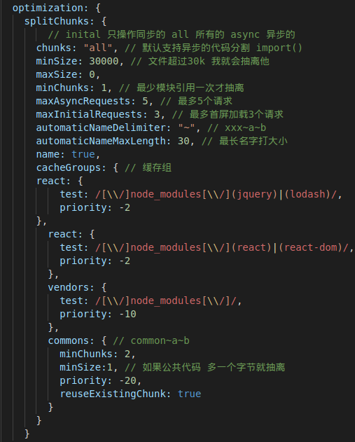

# WEBPACK 学习

## 依赖工具webpack-cli

- 默认支持commonjs, es6 esmodle
- --mode production/development
- --env.development
- --config path
  - ex: ./build/webpack.base.js

## 文件配置

- ### 定义webpack.config.js

- ### 使用path解析绝对路径

  - path.resolve(__dirname, path)

- ### 配置环境变量

  - `module.exports = (env) => {`

    ​	`console.log(env)`

    ​	`let isEnv = env.development`

    `}`

  - 新建base,dev,prod文件

    - 引入 dev prod
    - 两种引入方案
      - 全部引用base
      - 分别引用Dev，Prod

- 使用webpack-merge合并base 和其他配置

  - merge(base,  dev/prod)

- webpack-dev-serve

  - 在内存中打包，不会产生文件
  - 配置devServer
    - port: 3000
    - gzip => compress: true
    - contentBase: path.resolve(__dirname, '../dist')

- 自动生成html文件，并引入打包后的js内容

  - public 文件夹中创建index.html

  - html-webpack-plugin

    - webpack.base.js 中引入该plugin

    - template: path.resolve(Path of Index.html)

    - filename: index.html

    - minify: !isDev && {

      ​		removeAttributeQuotes: true

      ​		collapseWhitespace: true

      }

- 清除输出(dist)的目录 clean-webpack-plugin

  - 引入

## Loaders

- 解析的顺序为从右往左

  ### css loaders

- css-loader

  - 解析css语法

- style-loader

  - 讲解析的css 变成style标签插入到页面中

- `module: {`

  ​	`rules: [`

  ​		`{`

  `			test: /\.css$/,`

  `use: ['style-loader', 'css-loader']`			

  ​		`}`,

  ​		`{`

  `			test: /\.scss$/,`

  `use: ['style-loader', 'css-loader', 'sass-loader']`			

  ​		`}`

  ​	`]`

  `}`

- 如果css引入scss

  - `			test: /\.css$/,`

    `use: ['style-loader', {`

    `loader: 'css-loader',`

    `options: {importLoaders: 2}`

    `},'postcss-loader', 'sass-loader']`	

- 自动添加前缀

  - postcss
  - autoprefixer
  - postcss.config.js
    - plugins: [require('autoprefixer')]
    - 并且添加.browerslistrc

- mini-css-extract-plugin

  - loader配置isDev? 'style-loader': miniCssExtractPlugin

  - plugin并引入 !isDev && new MinicssExtractPlugin({

    ​	filename: 'css/mian.css'

    })

  - plugins.filter(Boolean)

  - 生产环境配置

    - 安装optimize-css-assets-webpack-plugin

    - optimization: {

      ​	minimizer: [

      ​		new optimize-css-assets-webpack-plugin()

      ​	]

      }

- terser-webpack-plugin

  - 压缩js
  - 生产环境中 new 在plugin里面

### 图片loader

- file-loader
- test: /\.(jpe?g|png|gif)$/
- use: {loader: 'url-loader', options: {name: 'image/[name/contentHash].[ext]', limit: 100 * 1024}}
  - 小于100kb的变成base64.大于自动变file-loader

### 字体 icon loader

- test: /.(woff|ttf|eot|svg)$/
- use: 'file-loader'

### jsLoader

- babel
  - @babel/core
  - @babel/preset-env
  - babel-loader 调用core转化时候用preset env
- es6 => es5
  - test: /\.js&/
  - use: 'babel-loader'
  - 添加.babelrc 执行顺序为倒叙
  - presets: {"@babel/preset-env", {useBuiltIns: 'usage', corejs: 2}}
  - plugins: []
- 装饰器
  - @babel/plugin-proposal-class-properties{loose: true}
  - @babel/plugin-proposal-decorators{legacy: true}
- corejs
- @babel/plugin-transform-runtime

### React

- @babel/present-react
- @babel/present-typescript
- 

### Vue

- vue loader
  - 并且引入vue loader plugin
- vue templatete compiler
- 如若使用ts安装 vue property decorator
  - @babel/present-typescript, {allExtentions: true}

## webpack 优化

- ### 动态加载
  
  - import().then()
  - 需要引入 @babel/plugin-syntax-dynamic-import
- ### 热更新
  
  - devserver: {hot: true}
  - webpack.NamedModulesPlugin 热更新模块
  - webpack.HotModleReplacementPlugin 热更新插件

### 优化css

- 插件 purgecss-webpack-plugin glob
- glob.sync(path(任意文件夹下的任意文件), {nodir: true})
- purgeCssWebpackPlugin
  - 只能配合minicss extract plugin
  - 传入paths(glob.sync(src/**/*), {nodir: true})

### 优化图片

- image-webpack-loader
- 减低分辨率,清晰度.
- test: /\png/
- use: []
- npm 搜索这个然后拷入配置

### CDN 加载  

需要在index.html中引入

	external: {
	
	'jquery': '$'
	
	}

add asset html cdn webpack plugin

	`new addcdnplugin(true, {`
		`jquery: 'https: //'`
	`})`

### 优化

使用了哪些模块

optimization:  {usedExports: true}

### Treeshaking

只支持es6语法

引用变量是否被删除 副作用

package.json 

css 不是副作用

	sideEffects: [
	
		"**/*.css"
	
	]

#### es6 module

#### Scope hoisting

会直接导出值

把里面其他代码都优化掉了

## DLL Plugin 打包速度优化

manifest.json

react: '打包后的文件'

reactdom: '打包好的文件'

产生缓存文件

dllPlugin = require(webpacl).DllPlugin

	{
	
	​	plugins: [
	
	​		new DllPlugin({name: 'react', path: path.resolve(__dirname, 	'dll/manifest.json')})
	
	​	]
	
	}

- 内部引用 dllreferenceplugin = require('weback').DllReferencePlugin

 	 - new dllRefer({

 	 manifext: path

 	 })

  - 同时需要引用

- add asset html webpack plugin

  - 添加资源插件
  - new add({filepath: path.resolve(__dirname, '*.dll.js')})

### 打包第三方

`entry: [react, react-dom]`

`output: {library: filename, libraryTarget: 'var/commonjs/commonjs2/umd/this'}`

node 用commonjs2

全局 就不配置S

### 不引用外部库(node_module)

- webpack-node-externals

### 动态加载

`import(/*webpackChunkname: ''video*/, './calc')`

`output: {`

​	`chunkFilename: '[name].min,js'`

`}`

原理jsonp

### 打包文件分析工具

entry 有三种写法 字符串,数组,对象

`entry:{a: "./src/a.js", b: './src/b.js'}`

`output: {filename: [name].js}`

HtmlWebpackPlugin: ({chunks: ['a'], chunksSortMode: 'manual'})

webpack-bundle-analyzer 代码分析插件 .BundleAnalyzerPlugin

new bundleANalyzerPlugin() 生产环境下

### 抽离第三方模块 splitchunks

- 不要和业务放到一起
- 添加缓存

生产环境下 将第三方模块进行抽离

官网查配置

`optimization: {splitChunks: []}`

#### dllplugin 不要和splitchunks 一起使用

- splitchunks 构建之时抽离出来
- dll plugin 构建之前抽出来

#### Speed measure

`const smw = new SpeedMeasureWebpackPlugin();`

`module.exports = env => {`

  `return smw.wrap({})`

`}`